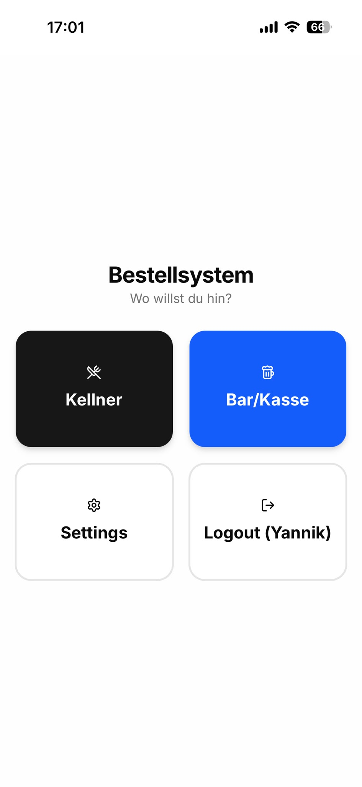
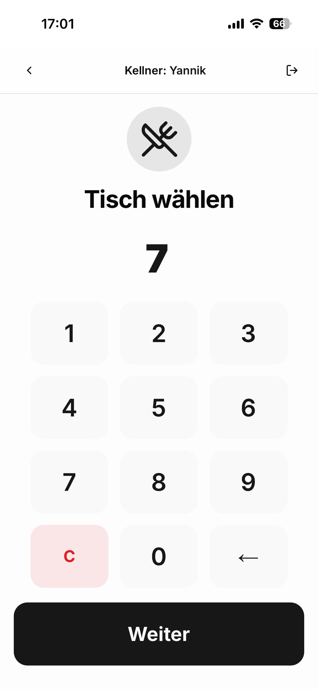
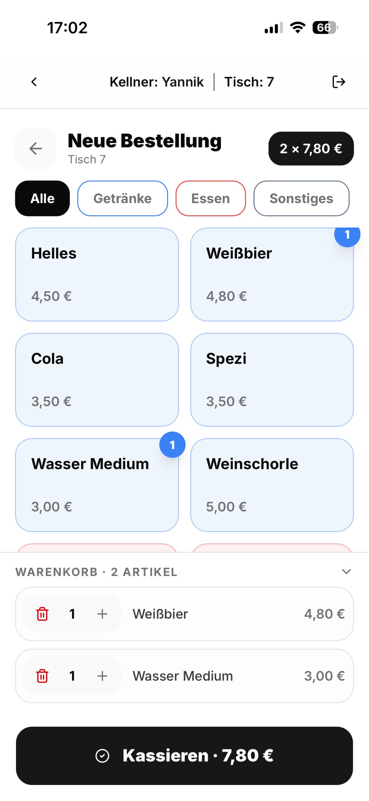
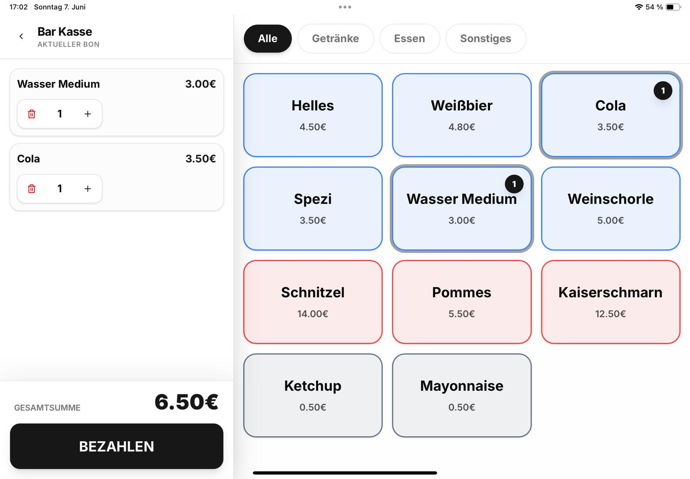
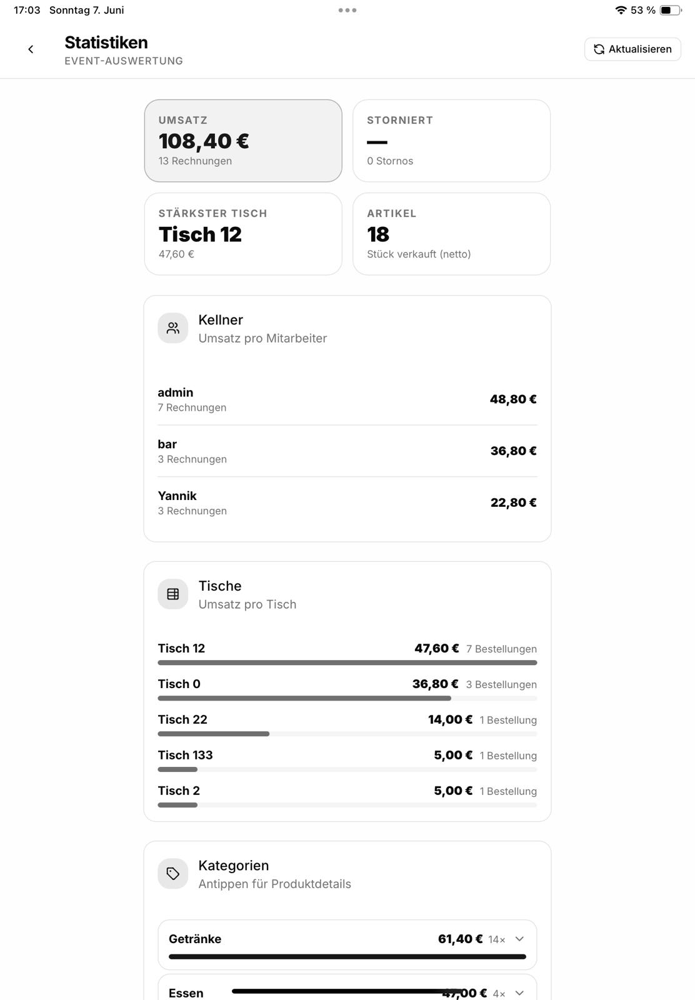
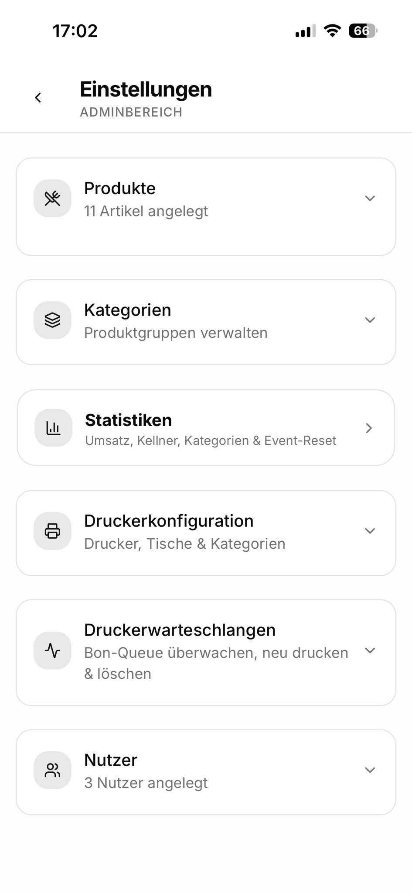

# HGV Bestellsystem

Kassen- und Bestellsystem für Veranstaltungen. Läuft als PWA auf Handys und Tablets, druckt Bons über Bon-Drucker und liefert Statistiken über das Event.

## Screenshots

<table>
  <tr>
    <td align="center"><b>Startseite</b></td>
    <td align="center"><b>Tischauswahl</b></td>
    <td align="center"><b>Kellner-Bestellung</b></td>
  </tr>
  <tr>
    <td></td>
    <td></td>
    <td></td>
  </tr>
  <tr>
    <td align="center"><b>Bar/Kasse (iPad)</b></td>
    <td align="center"><b>Statistiken</b></td>
    <td align="center"><b>Einstellungen</b></td>
  </tr>
  <tr>
    <td></td>
    <td></td>
    <td></td>
  </tr>
</table>

## Features

- **Kellner-App** — Tisch wählen, Artikel bestellen, direkt kassieren
- **Bar/Kasse** — Split-View auf iPad; Warenkorb links, Produkte rechts
- **Bon-Druck** — WebSocket-basierter Druckerclient; Bons werden per Regel auf Drucker geroutet (nach Tisch & Kategorie)
- **Druckerwarteschlangen** — Live-Übersicht im Adminbereich; Bons neu senden oder löschen
- **Push-Benachrichtigungen** — Admins werden per PWA-Push alarmiert wenn ein Drucker offline ist
- **Statistiken** — Umsatz, Kellnerauswertung, Tische, Kategorien; PDF-Export
- **PWA** — installierbar auf iOS & Android

## Architektur

```
┌─────────────────────────────────┐
│         Browser / PWA           │
│  Next.js 16 · React 19          │
│  Tailwind CSS · shadcn/ui        │
└────────────┬────────────────────┘
             │ HTTP / WebSocket
┌────────────▼────────────────────┐
│         Go Backend              │
│  net/http · gorilla/websocket   │
│  JWT-Auth · WebPush (VAPID)     │
└────────────┬────────────────────┘
             │ MySQL
┌────────────▼────────────────────┐
│         MySQL Datenbank         │
│  Produkte · Rechnungen · User   │
│  Druckereinstellungen           │
└─────────────────────────────────┘
             │ WebSocket
┌────────────▼────────────────────┐
│         Druckerclient           │
│  → github.com/yschaffler/       │
│ HGV-Bestellsystem-Druckerclient │
└─────────────────────────────────┘
```

## Setup

### Voraussetzungen

- Docker & Docker Compose
- Druckerclient auf dem Gerät mit dem Bon-Drucker (siehe [HGV-Bestellsystem-Druckerclient](https://github.com/yschaffler/HGV-Bestellsystem-Druckerclient))

### Starten

```bash
# Umgebungsvariablen setzen
cp .env.example .env
# BESTELLSERVICE_PASSWORD, PRINTER_SECRET anpassen

docker compose up -d
```

Die App ist dann unter `http://<server-ip>:8000` erreichbar.

### Umgebungsvariablen

| Variable | Beschreibung |
|---|---|
| `BESTELLSERVICE_PASSWORD` | MySQL Root-Passwort |
| `BESTELLSERVICE_HOST` | MySQL Host (Standard: `db`) |
| `BESTELLSERVICE_PORT` | MySQL Port (Standard: `3306`) |
| `PRINTER_SECRET` | Gemeinsames Geheimnis für Druckerclient-Verbindung |

## Standard-Login

| Benutzername | Passwort | Rolle |
|---|---|---|
| `admin` | `admin` | Admin |

**Passwort nach dem ersten Start ändern.**

## Push-Benachrichtigungen einrichten

1. App als PWA auf dem Admin-Handy installieren
2. Einstellungen → Druckerwarteschlangen öffnen
3. „Benachrichtigungen aktivieren" antippen
4. Benachrichtigung im Browser erlauben

Der Server sendet automatisch eine Push-Nachricht wenn ein Drucker >3 Minuten offline ist und noch Bons in der Queue hängen.

> **Hinweis:** Push-Benachrichtigungen erfordern HTTPS oder `localhost`.
